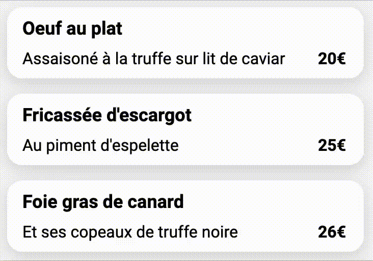

# Ohmyfood - Projet d'études

- https://hugodeyrigoyen.github.io/ohmyfood/
- Dans le cadre des mes études de développeur web
- Site animé de réservation de menu de restaurant en **HTML et CSS uniquement** (pas d'autre language, ou de framework)
- Utilisation de SCSS

## Contexte

- Instructions :
  https://s3.eu-west-1.amazonaws.com/course.oc-static.com/projects/Front-End+V2/P3+CSS+animations/DW+P3+-+Brief+creatif+-+Ohmyfood!.pdf
- Maquettes de départ :
  https://course.oc-static.com/projects/DW_P3/Maquette+Ohmyfood.zip
  
  
  
  
